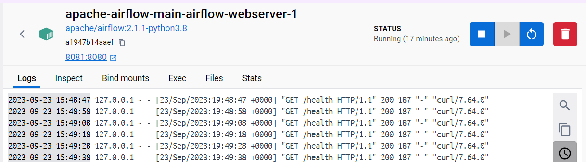
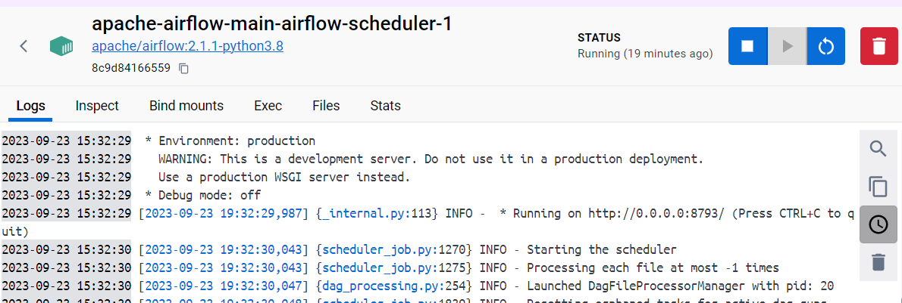
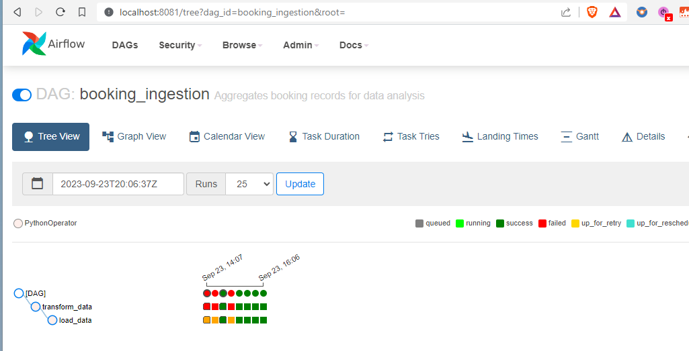

# Airflow Data ingestion pipeline

## Introduction:
I've created this prject to demo a data ingestion pipeline using Apache Airflow. 
1. Set up Airflow and sqlite using Docker
2. Create Sqlite db and tables for receiving data
3. Write a DAG to ingest data from a csv to Sqlite table in real-time

## DAG Details
Transform raw data:
* Function `transform_data` processes data for a given date and time. 
* Data Source: Reads data from CSV files, including 'booking,' 'client,' and 'hotel' datasets.
* Standardization: Ensures consistent date formatting for clarity and accuracy.
* Currency Conversion: Converts costs from Euros to British Pounds for uniformity.
* Data Refinement: Removes unnecessary columns to simplify the dataset.
* Structured Output: Saves the processed data in a well-organized format.

Load transformed data:
* Function `load_data` loads data for a specified date and time
Database Connection: It connects to a SQLite database located at "/usr/local/airflow/db/datascience.db."
* Table Creation: If the "booking_record" table doesn't exist, it creates it with a predefined schema, defining column names and data types.
* Data Reading: Processed data is read from a CSV file based on the provided date and time.
* Data Insertion: The read data is then appended to the "booking_record" table in the database.

## Table schema
'''
    CREATE TABLE IF NOT EXISTS booking_record (
        client_id INTEGER NOT NULL,
        booking_date TEXT NOT NULL,
        room_type TEXT(512) NOT NULL,
        hotel_id INTEGER NOT NULL,
        booking_cost NUMERIC,
        currency TEXT,
        age INTEGER,
        client_name TEXT(512),
        client_type TEXT(512),
        hotel_name TEXT(512)
'''


## Step by step instructions

1. Prepare the database first `docker-compose up airflow-init`

This is going to create db/airflow.db sqlite database. 
Airflow WebServer and Scheduler are created
    
    

2. Add raw data for current execution date and hour to be ingested

3. Launch Airflow `docker-compose up`

Wait for scheduler and webserver to get healthy, then go to `localhost:8081` 

```python
username: admin
password: airflow
```

4. Enable the DAG and watch it ingest data.
